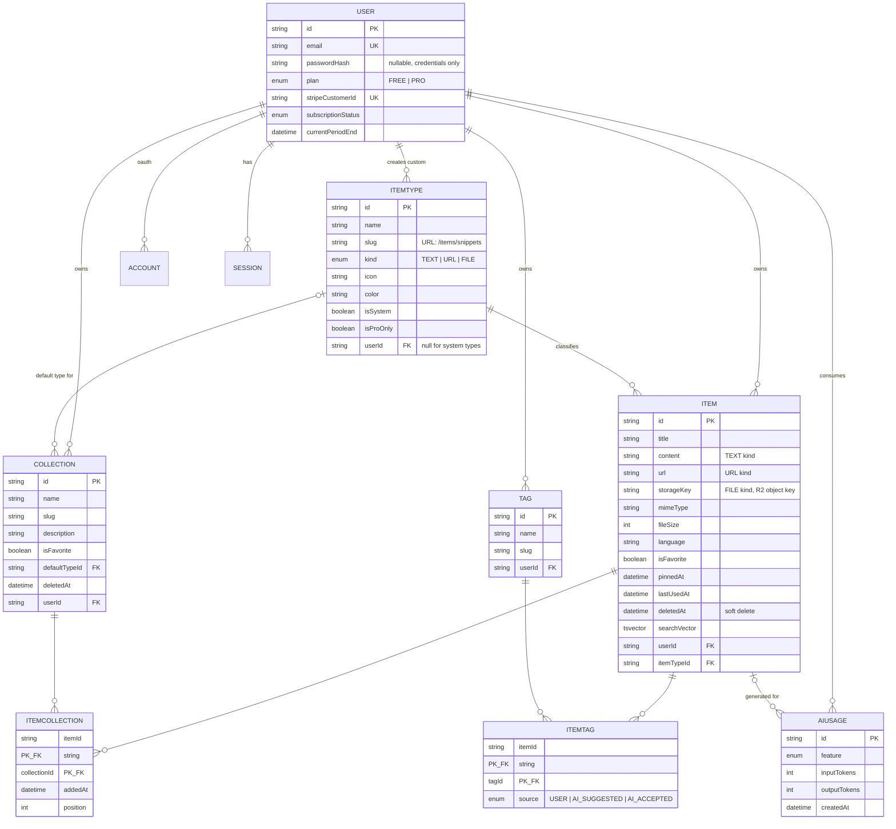
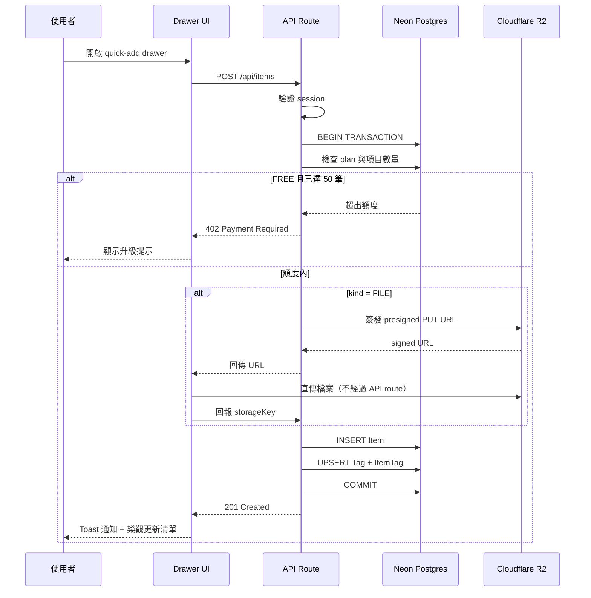
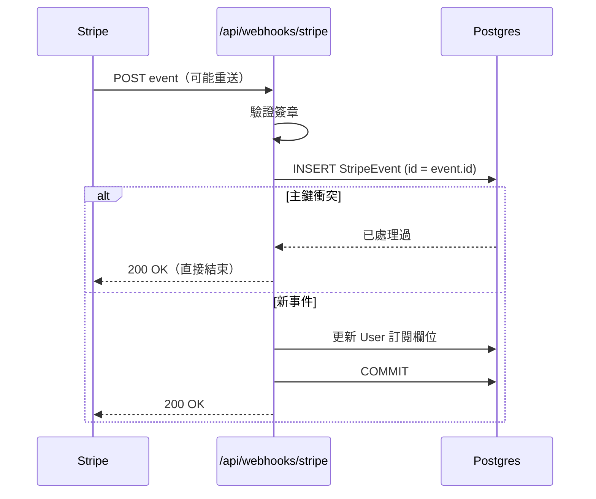
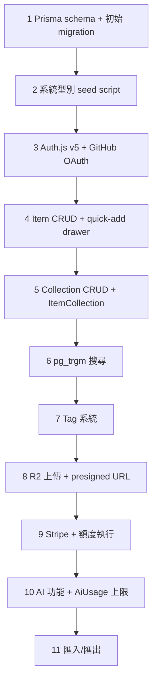

# DevStash — Project Overview

> 這份文件是 DevStash 的單一事實來源（single source of truth）。
> 資料模型以 `prisma/schema.prisma` 為準，本文負責記錄「為什麼這樣設計」。
> 改動資料結構時，請同時更新本文的〈資料模型決策〉章節。

---

## 1. 產品定位

**一句話**：開發者所有零散資產（程式碼片段、AI prompt、指令、連結、筆記、檔案）的單一、快速、可搜尋的中樞。

**要解決的痛**：資產散落在 VS Code、Notion、聊天記錄、書籤、gist、bash history、隨機資料夾裡，造成 context switching、知識遺失、工作流不一致。

**明確不做的事**（劃清邊界，避免範圍蔓延）：

- 不做團隊協作與分享（v1 為單人工具）
- 不做版本控制或 diff
- 不做 IDE 外掛（v1 先做 Web）
- 不做即時同步／多人編輯

---

## 2. 目標使用者

| 類型                       | 核心需求                             | 主要使用型別           |
| -------------------------- | ------------------------------------ | ---------------------- |
| Everyday Developer         | 快速取用片段、指令、連結             | snippet, command, link |
| AI-first Developer         | 保存 prompt、context、system message | prompt, file           |
| Content Creator / Educator | 存放程式碼區塊、說明、課程筆記       | snippet, note          |
| Full-stack Builder         | 收集 pattern、boilerplate、API 範例  | snippet, file, link    |

四類人共通的動作是「**存下來，之後三秒內找回來**」。所有設計決策都以這條為準繩：搜尋速度與新增速度優先於功能豐富度。

---

## 3. 資料模型

### 3.1 ER 圖



### 3.2 完整 Schema

以 `prisma/schema.prisma` 檔案為準（隨附）。以下為結構摘要：

```
Auth          User, Account, Session, VerificationToken
Core          Item, ItemType, Collection, ItemCollection, Tag, ItemTag
Ops           AiUsage, StripeEvent, PendingDeletion
Enums         ItemKind, Plan, SubscriptionStatus, TagSource, AiFeature
```

### 3.3 資料模型決策（與原始草稿的差異）

原草稿寫得不錯，但以下幾點在實作時會出問題，已修正：

**`fileUrl` → `storageKey`**
R2 私有 bucket 的存取網址是簽名網址，有效期通常 15 分鐘到數小時。把它存進資料庫，資料會在幾小時後全部失效。正確做法是存 object key（例如 `users/{userId}/items/{itemId}/{uuid}.png`），讀取時即時簽發網址。

**`contentType` 從 Item 移到 ItemType，並改名為 `kind`，值由 2 個變 3 個**
你自己寫「A type can be text, url or a file」，但 `contentType` 只有 `text | file`，link 無處可放。更重要的是：內容形態是「型別」的屬性，不是「單一項目」的屬性。放在 Item 上，資料庫允許你建立一個 `contentType = file` 的 snippet。放在 ItemType 上，這種狀態根本無法表達。

**`Tag` 補上 `userId`**
原草稿的 TAG 只有 id 和 name。這代表全站共用一個標籤命名空間——A 使用者建立的 `internal-api` 會出現在 B 使用者的自動完成清單裡。這是資料外洩，不是功能。同時補 `slug` 做正規化去重（`React Hooks` 與 `react hooks` 應該是同一個標籤）。

**`ITEMTAG` join table 明確建模**
原草稿只在 ITEM 下註記「fields for tag relations」。用 Prisma 的隱式 m-n 也可以，但顯式 join table 讓你能記錄 `source`，區分 AI 建議與使用者確認的標籤——這是 F 區 AI auto-tag 功能的前提。

**`isPro: Boolean` → `plan` + `subscriptionStatus` + `currentPeriodEnd`**
布林值裝不下訂閱生命週期。真實情境：使用者 10/1 取消訂閱，但已付到 10/31。這段期間 `isPro` 該是 true 還是 false？還有 `past_due`（扣款失敗但寬限中）、`trialing`、`unpaid`。用 enum 記錄 Stripe 的實際狀態，`isPro` 變成應用層的衍生判斷：

```ts
const isPro =
  user.plan === "PRO" &&
  (user.subscriptionStatus === "ACTIVE" ||
    user.subscriptionStatus === "TRIALING") &&
  (user.currentPeriodEnd ?? new Date(0)) > new Date();
```

**`isPinned: Boolean` → `pinnedAt: DateTime?`**
布林值無法排序。使用者釘選 5 個項目後，它們的順序是隨機的。時間戳同時提供狀態與排序。

**新增 `lastUsedAt` / `useCount`**
E 區列了「Recently used」功能，但原資料模型沒有任何欄位能支撐它。`updatedAt` 不能用——它記錄的是編輯，不是使用。

**新增 `deletedAt` 軟刪除**
兩個理由：一是使用者會誤刪；二是額度計算——已刪除的項目不該佔用 free tier 的 50 個名額，硬刪除則會讓「刪掉重來」變成規避額度的手段（可接受，但你要有意識地決定）。

**新增 `mimeType`**
決定圖片走預覽、其他走下載，同時是上傳白名單的依據。缺這個欄位你只能靠副檔名判斷，而副檔名是使用者可控的輸入。

**`ItemType` 的 partial unique index**
系統型別的 `userId` 是 NULL。Postgres 把每個 NULL 視為相異值，所以 `@@unique([userId, slug])` **擋不住兩個都叫 `snippet` 的系統型別**。需要一個帶 `WHERE "userId" IS NULL` 的 partial unique index。Prisma 從 7.4 起以 preview feature 支援 `where: raw(...)` 語法；若不開啟，就在 migration 裡手寫 SQL。

**新增 `StripeEvent`**
Stripe webhook 保證 at-least-once 送達，重送是常態而非異常。沒有冪等表，一次網路抖動就會讓使用者被升級兩次或被扣兩次點數。用 Stripe 的 event id 當主鍵，插入失敗就代表已處理過。

**新增 `PendingDeletion`**
資料庫的 `onDelete: Cascade` 刪得掉 Item 資料列，刪不掉 R2 上的檔案。沒有清理機制，你的儲存費用會單調遞增，而且永遠不知道哪些物件是孤兒。

### 3.4 刻意「不做」的優化

以下是常見的過早優化，v1 明確不做，等指標出現再說：

- **`Collection.itemCount` 快取欄位** — 直接 `count()`，資料量到不了需要快取的規模。
- **`Collection.dominantTypeId` 快取欄位** — UI 需要「集合中最多的型別」來決定卡片底色，用一次 `groupBy` 查詢即可，不要在每次寫入時維護。注意不要在列表頁對每張卡片各查一次（N+1）。
- **Redis** — 你的筆記寫「Maybe」。答案是 v1 不要。Neon 的連線池加上 Next.js 的 `unstable_cache` 已經夠了。等到 AI 速率限制需要跨請求的計數器時再引入。

---

## 4. 關鍵流程

### 4.1 新增項目（含額度檢查）



檔案採 presigned URL 直傳，不經過 Next.js API route。Vercel 的 serverless function 有 body size 限制，而且讓大檔案佔用函式執行時間是浪費。

### 4.2 訂閱狀態同步



### 4.3 資料權限模型

v1 沒有團隊功能，權限規則極簡但必須一致執行：

```
每一個對 Item / Collection / Tag 的查詢，
WHERE 條件都必須包含 userId = session.user.id。
```

建議用一層薄薄的 repository 函式包住 Prisma，把 `userId` 變成必填參數，而不是靠每個 API route 自己記得加。這是 v1 最容易出、也最傷的 bug。

---

## 5. 搜尋策略

C 區要求跨 content / tags / titles / types 搜尋，但沒有寫實作方式。兩階段：

**階段一（v1）— `pg_trgm`**

```sql
CREATE EXTENSION IF NOT EXISTS pg_trgm;
CREATE INDEX item_title_trgm_idx ON "Item" USING GIN (title gin_trgm_ops);
```

用 `ILIKE '%query%'` 查標題與內容。實作 30 分鐘，在數千筆項目內反應時間可接受，而且支援錯字容忍。

**階段二 — tsvector generated column**

當單一使用者項目數破萬、或需要排序相關性時再上：

```sql
ALTER TABLE "Item" ADD COLUMN "searchVector" tsvector
  GENERATED ALWAYS AS (
    setweight(to_tsvector('simple', coalesce(title, '')), 'A') ||
    setweight(to_tsvector('simple', coalesce(description, '')), 'B') ||
    setweight(to_tsvector('simple', coalesce(content, '')), 'C')
  ) STORED;

CREATE INDEX item_search_idx ON "Item" USING GIN ("searchVector");
```

Schema 中以 `Unsupported("tsvector")` 宣告，實際欄位由 migration 建立。查詢用 `$queryRaw`。

用 `'simple'` 而非 `'english'`：程式碼片段裡的識別字不該被詞幹還原（`useState` 不應被切成 `usest`）。若之後要支援中文筆記，需要另外處理分詞。

**標籤搜尋**不要塞進 tsvector（標籤會變動，generated column 只能引用同一列的欄位）。標籤走 `ItemTag` join 過濾，與全文檢索的結果做交集。

---

## 6. 商業模式

|                | Free                   | Pro（$8/月・$72/年） |
| -------------- | ---------------------- | -------------------- |
| 項目數         | 50                     | 無限                 |
| 集合數         | 3                      | 無限                 |
| 系統型別       | 除 file / image 外全部 | 全部                 |
| 檔案與圖片上傳 | ✗                      | ✓                    |
| 自訂型別       | ✗                      | ✓（延後實作）        |
| 搜尋           | 基本                   | 基本（v1 無差異）    |
| AI 功能        | ✗                      | ✓                    |
| 資料匯出       | ✗                      | ✓（JSON / ZIP）      |
| 支援           | 社群                   | 優先                 |

**額度執行的位置**：在 API route 的 transaction 內檢查，不要只在 UI 擋。查詢須排除 `deletedAt` 不為 null 的資料列。

**AI 成本護欄**：Pro 也需要上限。`AiUsage` 表提供每使用者、每功能、每時間窗的用量統計，據此設每日上限（建議起始值：每日 100 次 AI 呼叫）。gpt-5-nano 單價低，但沒有上限就等於把 API key 交給使用者。

**開發期策略**：所有使用者可存取全部功能，但**權限判斷的程式碼路徑必須從第一天就寫好**。做法是把 `isPro` 判斷集中在一個函式裡，開發期讓它 `return true`。不要用 if 註解掉檢查——那些檢查永遠不會被加回去。

---

## 7. 技術棧

| 層        | 選型                        | 備註                           |
| --------- | --------------------------- | ------------------------------ |
| Framework | Next.js 16 / React 19       | SSR 頁面 + 動態元件，單一 repo |
| 語言      | TypeScript                  |                                |
| 資料庫    | Neon PostgreSQL             |                                |
| ORM       | Prisma 7.4+                 | 見下方版本注意事項             |
| 檔案儲存  | Cloudflare R2               | presigned URL 直傳             |
| 認證      | Auth.js v5 (NextAuth)       | Email/密碼 + GitHub OAuth      |
| AI        | OpenAI gpt-5-nano           |                                |
| 樣式      | Tailwind CSS v4 + shadcn/ui |                                |
| 快取      | 無（v1）                    | Redis 延後                     |

### Prisma 版本注意事項

**Prisma 8 已經發布，官方文件預設為 v8，v7 文件移至 `/orm/v7` 路徑。** 你的筆記寫 Prisma 7，可以繼續用（v7 仍在維護），但要知道現在的「latest」不是 7。

v7 相對 v6 的三個破壞性變更會直接影響你的設定檔：

1. `generator` 的 provider 從 `prisma-client-js` 改為 `prisma-client`，且 `output` 變成必填——生成的 client 不再放在 `node_modules`，而是放進你的原始碼目錄。記得加進 `.gitignore`。
2. `datasource` 區塊不再接受 `url`。連線字串移到 `prisma.config.ts`。
3. `new PrismaClient()` 不能無參數呼叫，必須傳入 driver adapter：

```ts
import { PrismaClient } from "../generated/prisma/client";
import { PrismaPg } from "@prisma/adapter-pg";

const adapter = new PrismaPg({ connectionString: process.env.DATABASE_URL });
export const prisma = new PrismaClient({ adapter });
```

### Migration 紀律

你的筆記寫「NEVER use db push」，這條要更精確一點——`db push` 在 **schema 探索階段**是合理工具，只是不能碰共用資料庫。實務規則：

- 本機獨立資料庫（Docker 或 Neon branch）：`db push` 快速試錯，可以用
- 任何會被別人或 CI 讀到的資料庫：一律 `prisma migrate dev` 產生 migration 檔
- 部署：`prisma migrate deploy`，永不 `migrate dev`
- 需要手寫 SQL（partial index、generated column、CHECK constraint）時：`prisma migrate dev --create-only`，編輯 SQL，再 apply

### screenshots 截圖

請參考下面的截圖，作為儀錶板UI的基礎，它不必完全精確。將其作為參考。

@context/screenshots/dashboard-ui-drawer.png
@context/screenshots/dashboard-ui-main.png

---

## 8. UI／UX

**視覺方向**：現代、極簡、開發者取向。深色為預設。乾淨的字體排印、充足留白、細微邊框與陰影。參考 Notion、Linear、Raycast。

**版面**：可收合側邊欄 + 主內容區。側邊欄放型別連結（Snippets、Commands…）與最近的集合。主區為集合卡片網格（背景色 = 最多的型別色），集合下方顯示項目卡片（邊框色 = 該項目型別色）。單一項目在 drawer 中開啟。

**型別視覺對照**

| 型別    | 色碼      | 圖示       | kind |
| ------- | --------- | ---------- | ---- |
| Snippet | `#3b82f6` | Code       | TEXT |
| Prompt  | `#8b5cf6` | Sparkles   | TEXT |
| Command | `#f97316` | Terminal   | TEXT |
| Note    | `#fde047` | StickyNote | TEXT |
| File    | `#6b7280` | File       | FILE |
| Image   | `#ec4899` | Image      | FILE |
| Link    | `#10b981` | Link       | URL  |

`#fde047` 在深色背景上對比度很高、在淺色背景上則低於 WCAG AA 標準（約 1.5:1）。淺色模式下的 note 需要換一個較深的黃色（例如 `#a16207`），或只用於邊框而不用於文字。

**響應式**：桌面優先，行動可用。側邊欄在行動裝置變成 drawer。

**微互動**：平滑轉場、卡片 hover 狀態、操作 toast、載入骨架屏。

---

## 9. 待你決定的事

1. **快速新增 drawer 的鍵盤快捷鍵是什麼？** 這是整個產品的核心動線，值得優先設計。`Cmd+K` 是搜尋還是新增？Raycast 的做法是同一個入口，輸入即搜尋、無結果則建立。
2. **軟刪除的項目多久後永久清除？** 影響 `PendingDeletion` sweeper 的排程。建議 30 天。
3. **GitHub OAuth 與 Email/密碼使用同一個 email 時如何處理？** 選項是自動連結（`allowDangerousEmailAccountLinking: true`，方便但有風險）或要求使用者先登入再手動連結（安全但多一步）。這個決定必須在寫 auth 設定前做完。
4. **`content` 欄位有大小上限嗎？** Postgres `text` 沒有實質上限，但一個 5MB 的 prompt 會拖垮列表查詢。建議 free 100KB、pro 1MB，並在 API 層驗證。
5. **自訂型別的 `kind` 使用者可以自己選嗎？** 若可以，UI 需要解釋三種形態的差異；若不行，自訂型別就只能是 TEXT。建議 v1 限制為 TEXT，簡化很多。

---

## 10. 建議建置順序



第 1 到 6 步就是一個可用的產品。若你想找早期使用者驗證，那是自然的切點——在寫 Stripe 之前。

---

## 11. 參考連結

**Prisma**

- 升級到 Prisma 7 指南 — https://www.prisma.io/docs/guides/upgrade-prisma-orm/v7
- Prisma 7 發布公告 — https://www.prisma.io/blog/announcing-prisma-orm-7-0-0
- Indexes（含 partial index 的 `where` 語法） — https://www.prisma.io/docs/orm/prisma-schema/data-model/indexes
- 不支援的資料庫功能（手寫 migration SQL） — https://www.prisma.io/docs/orm/prisma-migrate/workflows/unsupported-database-features
- Generators 參考 — https://www.prisma.io/docs/orm/v7/prisma-schema/overview/generators

**其他**

- Auth.js v5 — https://authjs.dev
- Cloudflare R2 presigned URLs — https://developers.cloudflare.com/r2/api/s3/presigned-urls/
- Neon — https://neon.tech/docs
- shadcn/ui — https://ui.shadcn.com
- Postgres 全文檢索 — https://www.postgresql.org/docs/current/textsearch.html
